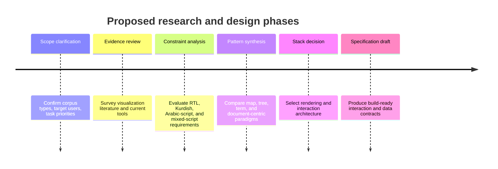
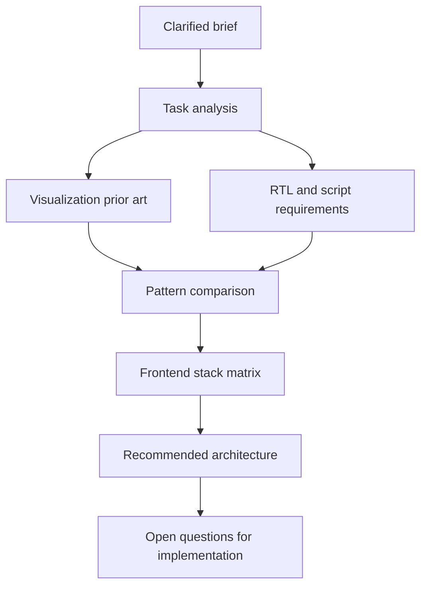

# Deep Research Report on Redesigning the Kurdish Data Explorer Visualization Layer

## Clarified scope and assumptions

The original prompt described the topic as unspecified, but the uploaded project brief clarifies the intended subject: a redesign of the visualization layer for the Kurdish Data Explorer, a React/Vite front end with a FastAPI/SQLite back end that ingests PDFs, computes multilingual embeddings, clusters documents, and needs a more useful exploratory interface for semantic neighborhoods, categories, sources, time, and document drill-down. I therefore treat the topic as clarified and proceed directly to research rather than generating hypothetical topic options across unrelated domains. fileciteturn0file0

I assume an engineering and product audience, an expository English deliverable, no fixed deadline, and a depth target of “concise but rigorous.” I also assume the redesign should preserve the current semantic-search pipeline rather than replace the underlying embedding system. Because the brief emphasizes Kurdish and neighboring Arabic-script text, the report treats right-to-left layout, mixed-script labeling, and font/shaping behavior as first-class requirements rather than peripheral localization details. fileciteturn0file0

A practical thesis emerges from the literature and tooling survey: the Kurdish Data Explorer should not be redesigned around a single raw UMAP scatterplot. The most defensible direction is a hybrid interface combining a density-aware semantic map, a linked hierarchical or faceted summary, and a document inspector with exemplar-driven explanations. Existing embedding-visualization tools such as Embedding Atlas, Nomic Atlas, and WizMap show that map-like exploration, search, and metadata cross-filtering scale well; older visualization research shows that tree views can outperform treemaps for hierarchy understanding; and dimensionality-reduction guidance warns against over-reading cluster size and inter-cluster distance in t-SNE or UMAP projections. citeturn36academia26turn20view0turn37academia43turn8search0turn8search5turn6search0turn7search0turn36academia24

## Research plan and workflow

The research plan below reflects the clarified brief and the evidence gathered from current documentation, open-source repositories, and relevant visualization literature. It starts from problem framing rather than implementation because the main failure mode in systems like this is usually choosing the wrong primary visual metaphor, not the wrong JavaScript library. fileciteturn0file0

The sequence matters. If the team jumps directly into library selection, it risks reproducing the current system’s limitation: a technically correct embedding projection with weak analytical affordances. By contrast, the strongest current systems treat semantic geography, metadata filtering, cluster explanation, and document reading as linked but distinct tasks. Embedding Atlas explicitly combines projection browsing, automatic clustering and labeling, nearest-neighbor search, linked dashboards, and metadata cross-filtering; Nomic Atlas similarly emphasizes large-scale maps plus topic organization and semantic search; and Overview demonstrates the continued value of topic-tree triage when the real user task is deciding what to read next rather than admiring point clouds. citeturn21view0turn20view0turn13search0turn13search3

## Lessons from relevant visualization paradigms

Three families of prior work are most relevant. The first is topic-model and corpus-summary visualization. pyLDAvis remains a canonical example of topic interpretation: it exposes topic-term salience and topic prevalence and is explicitly designed to help users interpret fitted LDA models, but it is tightly coupled to LDA-style topics and not to arbitrary multilingual embedding spaces. Top2Vec improves semantic modeling by jointly embedding documents, words, and topics and can search them natively, but its own repository makes clear that it is fundamentally a topic-modeling and search library, not a polished exploratory front end; users seeking 2D document maps are often directed to manual UMAP reduction outside the main visualization flow. BunkaTopics moves further toward modern embedding-based topic modeling and visualization, but its current documentation still centers Python workflows and generated topic views rather than a production-grade browser UX for investigative reading. citeturn18view0turn19view3turn16search3turn19view2

The second family is corpus investigation and document triage. Overview is especially instructive because it organizes documents into a topic tree, supports search and tagging, and encourages analysts to move iteratively from broad topics into narrower nodes and then into documents. That interaction model is closer to what many real users of the Kurdish Data Explorer likely need: not merely “where are the points?” but “which coherent semantic neighborhoods exist, which ones are worth opening, and what representative documents justify the label?” Voyant Tools sits in a similar, older tradition of linked textual views, frequency/distribution panels, and reading support; its continuing repository activity suggests it is still maintained, but its visual idiom is fundamentally corpus-analysis workbench rather than embedding-native exploratory cartography. citeturn13search0turn13search3turn11search0turn11search1

The third family is large-scale embedding visualization. WizMap uses a multi-resolution summarization strategy and a map-like interaction model to scale to millions of points in the browser. Apple’s Embedding Atlas pushes this further with automatic clustering and labeling, kernel-density contours, nearest-neighbor search, linked dashboards, and WebGPU-backed rendering at the scale of a few million points. Nomic Atlas likewise couples map exploration with semantic topics, search, tagging, and high-scale sharing. These systems matter less as drop-in products than as proof that a good embedding interface is not just a 2D plot: it is a coordinated system of map, filters, labels, and detail views. citeturn37academia43turn36academia26turn21view2turn20view0

A skeptical reading of the dimensionality-reduction literature is essential here. Distill’s widely cited analysis of t-SNE shows that cluster sizes in a t-SNE plot are not meaningful and that distances between well-separated clusters may also be meaningless, depending on hyperparameters. The current UMAP documentation is more optimistic about inter-cluster distance than t-SNE, but it still makes clear that parameters such as `min_dist` and `n_neighbors` materially alter how tightly points pack and how much broad structure is preserved. A 2026 preprint by researchers associated with Embedding Atlas argues that the internal UMAP kNN graph can support more faithful sensemaking than the 2D projection alone by exposing representatives, dense cores, and local neighborhoods before projection distortion. The direct implication is that the Kurdish Data Explorer should treat the 2D map as one view over a richer neighborhood graph, not as the truth of the corpus geometry. citeturn6search0turn7search5turn7search0turn36academia24

That warning generalizes beyond embeddings. On hierarchy tasks, recent evaluation work found treemaps slower and less accurate than icicle plots for navigation and hierarchy understanding, while eye-tracking studies likewise found node-link and icicle designs more effective than treemaps on intuitive hierarchy understanding tasks. Word clouds remain common, but both the comparison literature and more recent reviews acknowledge their analytical limitations; coordinated “word storms” improve comparison over isolated clouds, yet they still function best as summary accents rather than primary analytical views. For the Kurdish Data Explorer, this means that if hierarchical clustering is surfaced, an icicle or columnar tree is safer than a treemap, and word clouds should never be the main explanation for a cluster. citeturn8search0turn8search5turn8search6turn5search4turn5search3

The table below condenses the most relevant paradigms.

| Paradigm | Main contribution | Main failure mode for this project |
|---|---|---|
| LDA topic interpretation with pyLDAvis | Strong topic-term interpretability; good for explaining discrete topic models. citeturn18view0 | Assumes LDA-like topics and does not naturally express multilingual embedding neighborhoods. citeturn18view0 |
| Topic-tree triage with Overview | Excellent for narrowing a large corpus into coherent folders and then documents. citeturn13search0turn13search3 | Weak at preserving semantic geography or neighborhood continuity. citeturn13search3 |
| Contrastive term exploration with Scattertext | Very effective for language differences across categories and discourse contrasts. citeturn19view0 | Not a global semantic map and not designed for cluster-overview navigation. citeturn19view0 |
| Embedding maps with WizMap or Embedding Atlas | Scales well; supports search, exploration, density cues, and linked metadata. citeturn37academia43turn21view2 | Raw 2D geometry can be over-interpreted without graph or exemplar support. citeturn6search0turn36academia24 |
| Treemap hierarchy views | Space-efficient overview. citeturn8search0 | Empirically worse than icicle or node-link for hierarchy understanding. citeturn8search0turn8search5 |
| Word clouds and word storms | Fast lexical summary; coordinated storms help comparison. citeturn5search4turn5search3 | Weak primary analysis method; poor substitute for document exemplars and metadata. citeturn5search4turn5search3 |

## Tooling landscape and reuse potential

The current tool ecology divides cleanly into reusable ideas and reusable code. At the idea level, Apple’s Embedding Atlas and Nomic Atlas are the strongest references. Embedding Atlas offers automatic clustering and labeling, density contours, nearest-neighbor search, linked dashboards, multimodal metadata support, and AI-agent access through MCP; it is MIT-licensed and had a public release as recently as July 2026. Nomic Atlas offers semantic topics, vector search, tagging, deduplication, and a Python client that was released in November 2025, though its TypeScript bindings appear materially older. These systems are good design references because they treat embeddings, metadata, and inspection as one coordinated workflow. They are less attractive as literal embedded dependencies unless the team is willing to adopt their product assumptions or service model. citeturn21view2turn21view1turn20view0turn21view3

BunkaTopics, Top2Vec, pyLDAvis, and Cluestar are better understood as analyst or prototyping tools. BunkaTopics is explicitly framed as a package for data cleaning, topic-model visualization, and frame analysis, with its latest public release in April 2024. Top2Vec remains useful because it automatically finds topics and creates jointly embedded topic, document, and word vectors, but its most recent release listed in the repository is from November 2023 and its visualization story is still comparatively DIY. pyLDAvis is mature and respected but LDA-specific and last released in April 2023. Cluestar is a lightweight library meant to help inspect clusters and compare embedding techniques, with a relatively small footprint and a July 2024 PyPI release. None of these, on current evidence, is a strong candidate for the Kurdish Data Explorer’s primary end-user frontend. citeturn19view2turn19view3turn19view4turn18view0turn14search0

Scattertext, Voyant, and Overview remain valuable pattern libraries. Scattertext’s strength is differential discourse visualization rather than semantic cartography, but it could inspire secondary views for category comparisons or source-specific language shifts. Voyant and Overview show durable interaction primitives for reading-oriented corpus work: term distribution, search, tagging, topic grouping, and linked document panes. These are precisely the kinds of secondary affordances that pure “AI map” products often underplay. If the Kurdish Data Explorer is meant for investigative use rather than demo aesthetics, these older workbench ideas should be borrowed aggressively. citeturn19view0turn11search0turn13search0turn13search3

Cosmograph and regl-scatterplot are the most relevant specialized rendering engines if the team wants to build rather than buy. Cosmograph supports both graph mode and embedding mode, GPU layout, in-browser analytics, filters, legends, and dashboards, but its documentation also notes technical limitations, including WebGL-extension problems on Apple devices, and its licensing is free only for non-commercial use and pre-revenue startups. regl-scatterplot is impressively fast and can render up to roughly 20 million points with lasso selection, but it is intentionally lower level: points must be normalized to `[-1, 1]`, only a limited set of point-value encodings is supported directly, and richer label/layout behavior must be built around it. That makes it attractive for an extreme-scale point layer but not, by itself, for a complete investigative UI. citeturn12search0turn12search2turn12search5turn12search8turn24view0turn25view2

The most consequential implementation choice is therefore not “which existing text-visualization product should we adopt?” but “which rendering substrate best supports a hybrid map-plus-reader workflow?” On that question, deck.gl is the strongest default. It has a React interface, a rich layer model, a production scatterplot layer, and a modular bundle story. Its own documentation explicitly discusses bundle-size trade-offs and tree-shaking, which matters for a React application expected to remain maintainable. Plotly and ECharts are excellent general charting systems, but Plotly’s React wrapper defaults to a very large bundle and is better suited to conventional chart dashboards than to a custom semantic explorer; ECharts is broad and performant yet less naturally aligned with a highly bespoke linked-reading workflow. visx and D3 give maximum control, but that very freedom means the team would need to engineer most of the difficult interaction and performance behavior itself. Vega-Lite is superb for declarative small multiples and faceted analytics, but it is not the right primary engine for million-point exploratory maps. citeturn22search0turn22search2turn22search3turn26search0turn25view4turn26search7turn22search7turn22search5turn22search4turn25view5turn25view0turn25view1

The table below summarizes the most relevant frontend options for the Kurdish Data Explorer.

| Frontend option | Strength | Constraint | Best role |
|---|---|---|---|
| deck.gl + React | Mature layer system, React-native entry point, strong scatter/density support, modular bundle strategy. citeturn22search0turn22search2turn22search3turn26search0 | Still requires custom label and document-pane logic. citeturn26search0 | **Primary recommendation** for the map layer |
| regl-scatterplot | Extremely scalable WebGL scatterplots with lasso, up to about 20M points. citeturn24view0 | Lower-level API, normalized coordinates, limited direct encodings. citeturn24view0 | Specialized point renderer if scale dominates |
| Cosmograph | Strong graph and embedding views, built-in filters and analytics. citeturn12search0turn12search2turn12search6 | Apple/WebGL limitations; licensing review needed for commercial deployment. citeturn12search0turn12search5 | Reference system or optional graph subview |
| Plotly | Broad chart inventory, WebGL-aware traces, active maintenance. citeturn25view4 | Default React bundle is large; custom explorer UX is awkward. citeturn26search7 | Secondary charts, not the main semantic map |
| Vega-Lite | Fast declarative linked charts and faceted analysis. citeturn23search2turn25view0 | Not ideal as the primary substrate for large custom maps. citeturn25view0turn25view1 | Secondary analytical panels |
| visx or D3 | Maximum control over custom SVG/HTML views. citeturn22search4turn25view5 | Highest engineering burden; performance must be engineered manually. citeturn25view5turn12search7 | Label overlays and bespoke side views |

## RTL and Kurdish text constraints

The redesign should assume that mixed-direction text is normal, not exceptional. W3C guidance on bidirectional text recommends explicitly marking opposite-direction inline phrases and using isolation rather than older embedding controls; its examples show exactly the kinds of spillover and punctuation-order problems that occur when Arabic-script text is mixed with Latin names, years, acronyms, or source labels. The same guidance recommends `bdi`, `dir="auto"`, or directional isolates when injecting strings whose direction may vary. This is directly relevant to Kurdish corpora, where labels may combine Kurdish, Arabic, English source names, dates, and numeric metadata in the same UI element. citeturn28search1turn28search3turn28search6turn35search8

At the rendering-surface level, the web platform already gives the necessary primitives. On Canvas, `CanvasRenderingContext2D.direction` is widely available and `fillText()` explicitly uses `font`, `textAlign`, `textBaseline`, and `direction` to render text. In SVG, the `direction` attribute can be applied at the outer `<svg>` level or to individual text elements and inherited through the text tree. The implication is straightforward: if the Kurdish Data Explorer draws labels on canvas or SVG, it should set text direction explicitly rather than hoping the surrounding document context will always propagate correctly through custom rendering layers. citeturn35search2turn35search4turn35search7

Arabic-script layout rules also constrain truncation and line wrapping behavior. The W3C Arabic layout requirements describe Arabic-script rendering as cursive and shaping-sensitive, note the importance of joining behavior and mixed-script handling, and describe line breaking primarily in terms of word-level wrapping rather than arbitrary character splitting. For an exploratory interface, that means cluster labels, document titles, and hover cards should avoid naïve character-by-character clipping, especially in narrow canvases or badges. Ellipsis should be applied after grapheme-aware measurement and ideally at word boundaries. Likewise, cluster-title chips that interleave Latin acronyms and Arabic-script phrases should be isolated to prevent punctuation drift. citeturn29search3turn29search0turn29search8

Font choice is not cosmetic here. The current open-source Arabic stack gives at least three credible options. The Noto Arabic repositories are actively maintained, with the Noto Arabic project and Noto Naskh Arabic releases updated through January 2026, and Google Fonts distributes variable Arabic families such as Noto Naskh Arabic and Noto Sans Arabic in its public repository. IBM Plex is also an official open-source family with a dedicated IBM Plex Sans Arabic package and explicit positioning toward UI environments. A sensible strategy is to use a UI-oriented sans family such as Noto Sans Arabic or IBM Plex Sans Arabic for controls, badges, and metadata, and a more reading-oriented face such as Noto Naskh Arabic for longer text excerpts if the product wants a more literary tone. The exact choice should be validated on Sorani-specific glyph coverage and the corpus’ dominant orthographic conventions, but the main requirement is consistency, explicit font fallback, and no silent reliance on browser defaults. citeturn33view0turn34view0turn34view2turn30search0

A final caution is empirical rather than doctrinal: in the official tool pages reviewed for embedding and text visualization platforms, Arabic/RTL behavior is rarely documented prominently. That does not prove these tools fail on Kurdish or Arabic-script text, but it does mean support should be treated as an integration risk requiring a prototype spike with real corpus labels, not assumed correctness from generic “text support” claims. This is one more reason to prefer a composable frontend architecture over a black-box widget. citeturn21view2turn20view0turn12search2turn24view0

## Recommended product and implementation direction

The strongest design direction is a three-layer exploratory workflow. The first layer is a semantic overview map that privileges density, regions, and exemplars over naked points. The second is a hierarchical or faceted summary that explains how semantic neighborhoods divide by category, source, or time. The third is a document inspector that makes the map legible by showing representative documents, snippets, metadata, and nearest neighbors. This structure is more defensible than a “pure embedding map” because it aligns with current embedding systems, corpus-triage tools, and the methodological caution around dimensionality reduction. citeturn36academia26turn20view0turn13search3turn36academia24turn6search0

For the overview itself, I would not lead with every point rendered equally. Even TensorFlow’s Embedding Projector samples UMAP to 5,000 points and t-SNE to 10,000 points for fast results, and approximate PCA is sampled too. That is a strong practical signal that a production interface should use level-of-detail rendering rather than full-detail equality across zoom levels. At far zoom, the Kurdish Data Explorer should show a density field, cluster hulls or contours, and only a sparse set of representative points or labels. At medium zoom, it should gradually reveal point clouds, cluster boundaries, and selected metadata encodings. At near zoom, it should reveal individual documents, hovering snippets, and local edges or neighbor lists. This matches the design logic in Embedding Atlas, WizMap, and large-scale map systems more broadly. citeturn37search0turn21view2turn37academia43

The overview should also be graph-aware. A useful 2D embedding view should be backed by kNN relationships, HDBSCAN or similar cluster assignments, and representative-document selection computed in the original or near-original neighborhood structure. The recent “UMAP’s kNN graph” paper is especially relevant because it suggests simple graph algorithms can identify representatives and dense cores that the 2D projection alone does not faithfully expose. In product terms, each cluster should expose at least: a stable cluster identifier, size, depth in any hierarchy, exemplar documents, top lexical cues, top metadata facets, and a local neighborhood graph or exemplar chain. LLM-written cluster names are fine as annotations, but they should always be backed by lexical evidence and clickable exemplars. citeturn36academia24turn20view0turn21view2

I would pair the map with an icicle or columnar hierarchy instead of a treemap. The hierarchy need not be visible at all times, but when users ask “what is inside this region?” or “how does this large topic split into subtopics?”, the hierarchy view should be the most reliable explanatory control. The evidence against treemaps for hierarchy comprehension is strong enough that using one here would be hard to defend unless space constraints are overwhelming. If the back end already computes hierarchical topic reduction, the hierarchy panel can simply expose those levels; if not, a local on-demand split per cluster could still feed the panel. citeturn8search0turn8search5turn8search6turn19view4

On the frontend stack, the cleanest architecture is deck.gl for the large-scale map layers, HTML or SVG overlays for labels and hovercards, and visx or D3 for secondary charts and layout components. deck.gl is the right compromise because it already supports React, scatterplot layers, composable layers, and a modular performance story; HTML/SVG overlays are then used for what WebGL is bad at, namely fine-grained typography, bidirectional text control, and accessible interaction chrome. This split is much safer for Kurdish and Arabic-script labels than trying to force every textual affordance through a GPU point renderer. If the corpus scale later proves extreme enough that deck.gl point rendering becomes the bottleneck, regl-scatterplot can be evaluated as a lower-level replacement for the point layer only, while preserving the rest of the UI architecture. citeturn22search0turn22search2turn22search3turn26search0turn24view0

The simplest buildable data contract from the existing back end would include, per document, projected coordinates, one or more cluster labels, a cluster-depth path, source/category/time metadata, language and script metadata, a shortlist of nearest neighbors, and one or more representative text snippets. Per cluster, the API should return exemplars, lexical descriptors, counts by category/source/time, and optional summaries. This is enough to support a map, a hierarchy pane, metadata filters, and a document reader without requiring the frontend to recompute anything expensive. It also preserves the option of swapping projection methods or clustering methods later without rewriting the UI. fileciteturn0file0

The redesign should avoid three common traps. The first is treating 2D distance as semantic truth. The second is using word clouds as explanations when exemplars and snippets are available. The third is pushing all labels into the map. Good systems make the map sparse and the side panel rich; bad systems make the map verbose and the side panel empty. If the product goal is genuine sensemaking rather than a nice-looking semantic atlas, the detail pane must carry substantial explanatory load. citeturn6search0turn5search4turn13search3turn36academia26

## Information still needed for a build-ready specification

The report is sufficient to choose a direction, but a few unresolved variables still affect the final interaction design. The most important is user task priority: exploratory reading, curation, error analysis, editorial triage, and search-intensive retrieval all imply slightly different emphasis. The second is corpus scale: tens of thousands, hundreds of thousands, and millions of documents require different default densities, label policies, and caching strategies. The third is linguistic profile: if the corpus mixes Sorani Kurdish, Arabic, English, Persian, and Latinized labels, then directionality and font fallback need to be tested with representative strings before finalizing any label system. The fourth is whether time is a minor metadata facet or a first-class analytical axis; if time matters deeply, a linked temporal strip or animated slice view becomes justified. These are not reasons to delay the redesign direction, only the remaining variables needed to turn it into tickets. fileciteturn0file0turn28search3turn29search3

If I had to reduce the entire report to one implementable recommendation, it would be this: build a **density-first, exemplar-backed semantic map** in React using **deck.gl plus HTML/SVG overlays**, pair it with an **icicle or columnar hierarchy pane**, and make the **document inspector** the main explanatory surface. Treat the 2D projection as a navigational index rather than a faithful geometry, and treat RTL typography and mixed-script labels as core architecture concerns from the first prototype. That recommendation is the most consistent synthesis of the project brief, the current embedding-visualization ecosystem, the dimensionality-reduction literature, and the web platform’s actual bidi and text-rendering constraints. fileciteturn0file0 citeturn22search0turn22search3turn8search0turn36academia24turn6search0turn28search1turn35search2turn35search7