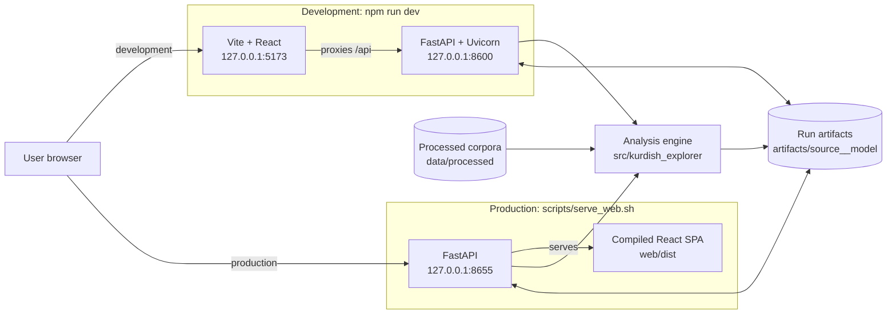
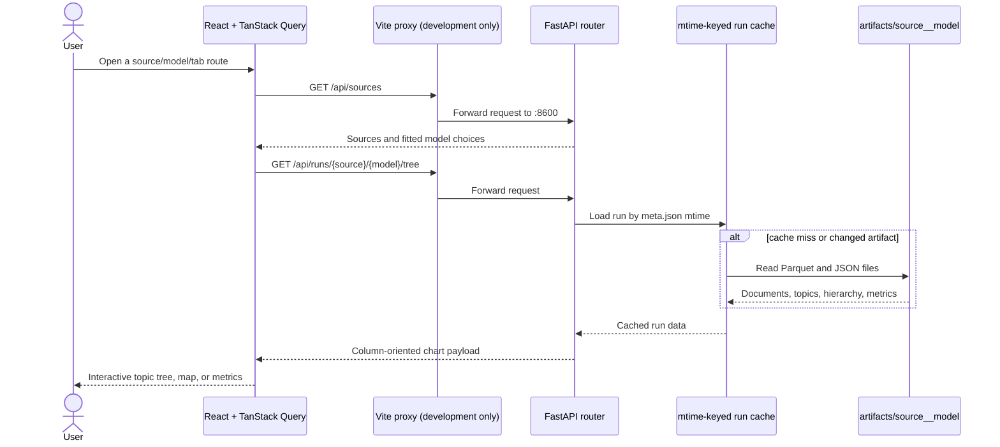
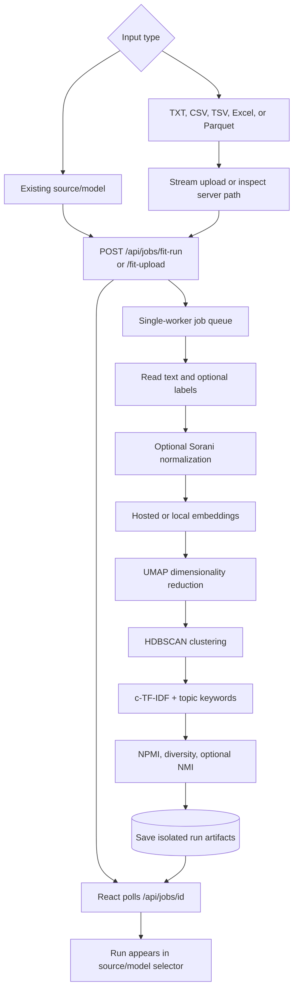

# Application Architecture and Operation

## Summary

Kurdish Data Explorer has one analysis engine and two user interfaces. The primary
application is a React single-page application backed by FastAPI. The retained
Streamlit interface is a compatibility path over the same `src/kurdish_explorer/`
pipeline and `artifacts/` directory. Development uses two cooperating processes;
production uses one FastAPI process that also serves the compiled React files.

The root command `npm run dev` now starts both development processes. Open
`http://127.0.0.1:5173`; Ctrl+C stops both servers.

## Key claims

- `npm run dev` is a full-stack development command: Vite on port 5173 and
  FastAPI on port 8600.
- The browser always calls relative `/api/...` URLs. Vite proxies them during
  development; FastAPI owns them directly in production.
- Expensive topic-model fitting does not happen during ordinary page loads.
  Exploration reads saved Parquet, JSON, and NumPy artifacts through an
  mtime-keyed cache.
- Fit requests use one in-process worker, preventing simultaneous model jobs from
  competing for GPU and memory.
- A fitted run is isolated by the key `<source>__<model>`; sources are not mixed.

## System map



The development and production boxes are alternatives, not services that need to
run together. The Streamlit command described below is a third, independent UI
option.

## Browser request flow



In production there is no proxy participant: the same FastAPI origin serves both
the SPA and `/api`.

## Fit and upload flow



Job state is held in the API process. Restarting the server loses the job history,
but completed artifacts remain on disk and are discovered again as fitted runs.

## Repository responsibilities

| Path | Responsibility |
| --- | --- |
| `web/src/` | React SPA: `app/` shell and providers, `features/` (overview, upload, explore workspaces), typed API client, Plotly views, query state |
| `server/kdx_server/` | Health, sources, models, runs, search, uploads, and job endpoints; production SPA host |
| `src/kurdish_explorer/` | Data preparation, normalization, embeddings, BERTopic, baselines, evaluation, pipeline orchestration |
| `scripts/` | Data preparation, training/tuning, production serving, and full-stack development startup |
| `artifacts/` | Immutable-by-convention outputs for each fitted source/model combination |
| `app/` | Retained Streamlit interface using the same engine and artifacts |

## How to run it

### One-time setup

```bash
pip install -r requirements.txt
npm install
```

`raw/sources/noor-ui/` must already contain the noor-ui workspace. If it is
missing, the dependency checkout is incomplete; restore it through the project's
provisioning process before installing packages. The raw source layer is evidence
and dependency input and must not be edited during wiki or application work.

### Development

```bash
npm run dev
```

Open `http://127.0.0.1:5173`. This is the preferred mode while changing React or
CSS because Vite provides hot reload. Optional overrides are `WEB_HOST`,
`WEB_PORT`, `API_PORT`, and `PYTHON`.

### Production-like local run

```bash
npm run build
./scripts/serve_web.sh
```

Open `http://127.0.0.1:8655`. FastAPI serves the built files from `web/dist`, so
there is only one process and one origin. Rebuild after frontend changes.

### Streamlit compatibility interface

```bash
/home/sawab/miniconda3/envs/ai/bin/python -m streamlit run app/streamlit_app.py \
  --server.headless true --server.port 8655
```

Do not run Streamlit and the production FastAPI app on the same port. Assign one
of them another port when comparing the interfaces.

## Why `npm run dev` previously did not run the application

The former root script delegated only to `npm run dev -w web`. That started Vite,
but it did not start FastAPI. The page could render while every `/api` request
failed because Vite's proxy target at `127.0.0.1:8600` was absent. The workaround
was to run Uvicorn and Vite in separate terminals. `scripts/dev.sh` now owns both
processes and cleans them up together.

Other failures have different meanings:

| Symptom | Cause | Resolution |
| --- | --- | --- |
| `Missing script: dev` | Command run outside the repository root, or an older checkout without root `package.json` | `cd` to the repository root and update the checkout |
| `noor-ui` cannot be resolved | Required local npm workspace is absent or dependencies were not installed | Run `./scripts/bootstrap_web.sh` or restore the workspace, then `npm install` |
| UI loads but says it cannot load sources | FastAPI is not on port 8600, or it exited during import/startup | Use root `npm run dev` and inspect the API log in the same terminal |
| `EADDRINUSE` | Port 5173 or 8600 is already occupied | Stop the old process or choose `WEB_PORT`/`API_PORT` consistently |
| `EPERM: operation not permitted ...:5173` | The execution environment forbids binding a listening socket | Run in a normal terminal/container with port permission; this is not a React error |
| Production URL returns 404 or an API-only page | `web/dist` has not been built | Run `npm run build` before `./scripts/serve_web.sh` |

## Evidence

- Root `package.json` defines the developer entry point and npm workspaces.
- `web/vite.config.ts` maps noor-ui source imports and proxies `/api` to port 8600.
- `web/src/api/client.ts` confirms that every browser request uses a relative
  `/api` path.
- `server/kdx_server/main.py` registers routers and mounts `web/dist` when the
  directory exists.
- `server/kdx_server/runcache.py` keys loaded runs by the modification time of
  `meta.json`.
- `server/kdx_server/jobs.py` uses a `ThreadPoolExecutor` with one worker.
- [[Implementation and Methodology]] records the migration, model behavior, and
  artifact-backed application details; [[Kurdish Data Explorer Pipeline]] records
  the research basis for the analysis stages.

## Connections

- [[Implementation and Methodology]] — as-built modeling and application record.
- [[Kurdish Data Explorer Pipeline]] — literature-grounded pipeline rationale.
- [[Project Presentation Overview]] — presentation-oriented project narrative.
- [[Topic Modeling]], [[Text Normalization]], [[Transformer Models]], and
  [[KDX-MiniLM-TSDAE (fine-tuned embedder)]].

## Open questions

- Job state is in memory; durable job recovery would be needed for a multi-process
  or remotely deployed service.
- Uploaded files are streamed, but the current fitting path still materializes
  document lists and embedding matrices; `docs/ARCHITECTURE.md` tracks the
  size-unbounded target.
- The production server has no authentication layer; remote or multi-user hosting
  needs explicit access control and upload-policy review.

## Change log

- 2026-07-18: Created the operational and architecture synthesis; added Mermaid
  system, request, and fitting flows; documented the unified development command
  and failure modes.
- 2026-07-19: Updated frontend paths after the feature-folder restructure
  (`web/src/app/` shell, `web/src/features/` for overview, upload, and the
  explore workspace views).
